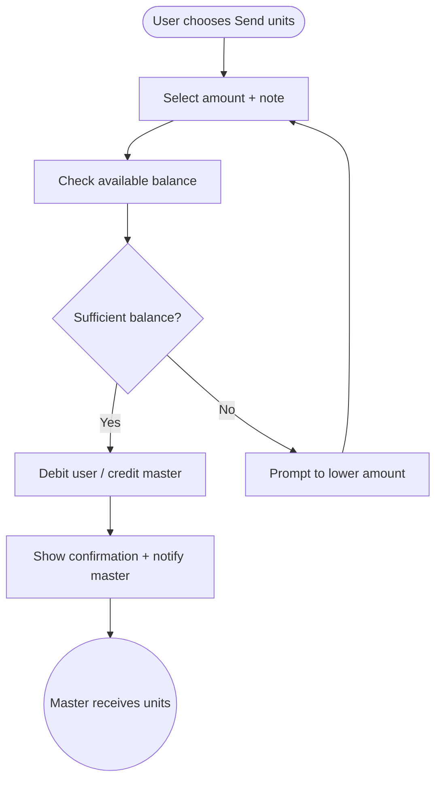

import FeatureSummary from '@site/src/components/FeatureSummary';

# Spend Lumens - Send to Master

## Summary

<FeatureSummary />

## Narrative
Sending units to a Master lets practitioners express gratitude and sustain the people guiding them. The flow appears after a session and in master profiles, giving users a simple slider to choose how many units to send and a note confirming impact.

Masters see the support reflected in their dashboards so they can understand who they are inspiring.

## Interaction
1. User taps "Send units" from the post-practice confirmation or master profile.
2. UI shows balance, suggested amounts, and contextual copy about how support helps the Master.
3. User selects an amount, optionally adds a note, and confirms.
4. Backend validates sufficient balance, debits the user, credits the master pool, and records the transaction.
5. Confirmation state thanks the user and offers to share or follow the master.
6. Master receives an in-app notification summarizing the support and updated totals.
7. History logs both sides of the transaction for transparency.

:::caution Edge Case
If the user’s balance changes mid-flow (e.g., spent elsewhere), disable confirm and prompt them to adjust the amount rather than failing after submission.
:::

:::tip Signals of Success
- Users feel emotionally satisfied supporting masters without friction.
- Masters can reconcile received units easily.
- Transaction failures remain rare.
:::

## Journey

## Requirements
- **Acceptance criteria**
  - GIVEN a user picks an amount within their balance WHEN they confirm THEN the transaction records on both user and master histories with matching IDs.
  - GIVEN the user tries to send more than they own WHEN validation runs THEN the UI blocks submission and explains the limit without charging.
  - GIVEN the master notification fires WHEN they open it THEN their dashboard reflects the updated total.
- **No-gos & risks**
  - Allowing offline mode transactions risks double-spending.
  - Lack of receipts can lead to disputes between users and masters.
  - If the UX feels transactional rather than appreciative, it could cheapen the ritual.

## Data
- **Primary metric:** Number of successful send-to-master transactions per active user.
- **Secondary checks:** Average units per send, decline rate due to insufficient balance, master satisfaction feedback, and retry volume.
- **Telemetry requirements:** Log user ID, master ID, amount, timestamp, success/failure status, notes (if allowed), balance snapshots, and notification IDs.

## Open Questions
- Should we allow scheduled recurring support for favorite masters later on?
- Do masters see sender names immediately or anonymized until they opt in?
