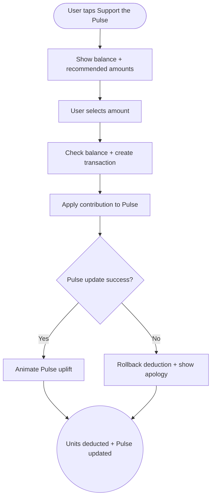

import FeatureSummary from '@site/src/components/FeatureSummary';

# Spend Lumens - Send to Pulse

## Summary

<FeatureSummary />

## Narrative
Supporting the Pulse with units translates personal reserves into collective care. Users can dedicate a portion of their balance to stabilize the Pulse, unlocking immediate visual feedback and copy describing the impact.

The experience lives near the Pulse visualization so the intent feels tangible rather than transactional.

## Interaction
1. User taps "Support the Pulse" from the Pulse screen or wallet.
2. Modal shows current balance, Pulse status, and recommended unit amounts with descriptions of their effect.
3. User selects an amount and confirms.
4. Backend validates balance, deducts units, and applies the contribution to the Pulse formula.
5. Pulse visualization animates based on the donated amount; copy explains the uplift.
6. Confirmation receipt is logged in the user's history and optionally shared to community feed.
7. If the user cancels mid-way, no deduction occurs and we track the intent for future nudges.

:::caution Edge Case
If the Pulse update fails after deducting units, roll back the transaction, show a calm apology with ETA, and ensure balances remain accurate.
:::

:::tip Signals of Success
- Users understand the direct link between supporting Pulse and community stability.
- Dedications post instantly without confusing balance discrepancies.
- Repeat contributions grow as users see the effect.
:::

## Journey

## Requirements
- **Acceptance criteria**
  - GIVEN a user submits a contribution WHEN the backend confirms THEN the Pulse visualization updates within the same session with clear attribution.
  - GIVEN the contribution fails AFTER deduction WHEN rollback completes THEN the user balance returns to its previous value and messaging explains the issue.
  - GIVEN a user cancels the modal WHEN they exit THEN no units are deducted and we respect their previous balance.
- **No-gos & risks**
  - Taking units without updating the Pulse destroys trust in the collective system.
  - Overusing urgent language could cause anxiety; copy must remain calm and optional.
  - Need to prevent users from sending amounts that would drop their balance below minimum thresholds if those exist.

## Data
- **Primary metric:** Percentage of Pulse visits that result in a support contribution.
- **Secondary checks:** Average contribution amount, rollback frequency, repeat contribution rate, and sentiment around copy.
- **Telemetry requirements:** Log amount selected, balance before/after, Pulse value change, success/failure code, share actions, and cancellation reasons.

## Open Questions
- Do we provide presets only, or allow a custom amount entry in 0.4?
- Should we cap daily contributions per user to protect their balances?
