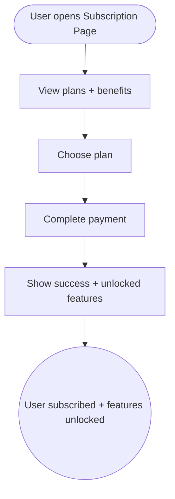

import FeatureSummary from '@site/src/components/FeatureSummary';

# Subscription Page

## Summary

<FeatureSummary />

## Narrative
The Subscription Page is the storefront for Ignition. It explains tiers, benefits (offline mode, saved practices, master follow, AWAWAY perks), and pricing while honoring AWATERRA’s calm tone. Users can enter from the profile, paywall modals, or contextual upsells, and should complete purchase within a few taps.

The page integrates platform billing (Apple, Google, web) and highlights authenticity—no flashing discounts, just clear value statements and testimonials. Accessibility, localization, and legal copy are first-class.

## Interaction
1. User opens the Subscription Page directly or via a paywall.
2. Page detects platform and displays available plans (monthly, annual, trials) with benefits.
3. User reviews FAQs, compares features, and taps “Start membership.”
4. Native purchase sheet opens (App Store / Google Play / web checkout).
5. On success, page confirms activation, outlines next steps, and deep-links into newly unlocked modules.
6. If the user already subscribes, page shows plan status, renewal date, and manage/cancel actions.
7. Error states explain what went wrong and provide support links.

:::caution Edge Case
When pricing fails to load (e.g., store connection issue), show placeholder copy and disable CTAs until data arrives to prevent mismatched pricing.
:::

:::tip Signals of Success
- Conversion from page view to completed subscription meets targets.
- Users immediately understand what they receive with membership.
- Support sees fewer “How do I subscribe?” or “Where do I cancel?” tickets.
:::

## Journey

## Requirements
- **Acceptance criteria**
  - GIVEN the user is not subscribed WHEN they open the page THEN pricing, benefits, and CTA render with localized copy and platform-specific terms.
  - GIVEN the user completes purchase WHEN returning to the page THEN it shows active status, renewal date, and manage options instead of upsell copy.
  - GIVEN purchase fails WHEN the store returns an error THEN the page surfaces the message, logs it, and offers retry/support guidance.
- **No-gos & risks**
  - Mixing currencies or unlocalized legal text can block approvals.
  - Using dark patterns (hidden cancel buttons) violates platform rules and user trust.
  - Failing to detect existing subscriptions leads to double charges.

## Data
- **Primary metric:** Subscription conversion rate from this page.
- **Secondary checks:** View-to-purchase latency, error rate by platform, cancellation taps initiated from the page, and fallback usage when pricing fails.
- **Telemetry requirements:** Log plan impressions, CTA taps, store responses, success/failure codes, fallback banners, and subsequent feature usage triggers.

## Open Questions
- Do we offer bundle pricing (e.g., family or duo plans) at launch?
- How prominently do we showcase paid-only content previews on this page?
