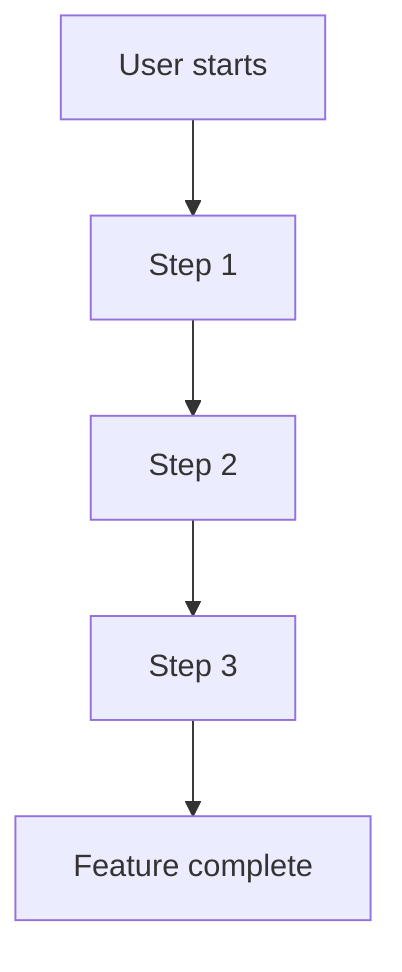

# Feature Documentation Template

Use this template when documenting new features for the AWATERRA platform.

## Feature Name
*[Clear, descriptive name of the feature]*

## Overview
*[Brief description of what this feature does and why it exists]*

## Purpose
*[The business or user need this feature addresses]*

## User Stories
*[How users will interact with this feature]*

### Primary User Story
*[Main use case]*

### Secondary User Stories
*[Additional use cases]*

## User Flow
*[Step-by-step user interaction flow with Mermaid diagram]*

## Visual Design
*[Visual elements, layout, and styling requirements]*

## Acceptance Criteria
*[What the feature must do - user-focused requirements]*

## Examples
*[Visual examples, mockups, or user scenarios]*

## Related Documentation

- [Capabilities Overview](/docs/capabilities/intro)
- [Features Overview](/docs/features/intro)
- [Version Roadmap](/docs/versions/intro)

---

*Template last updated: December 2024*
