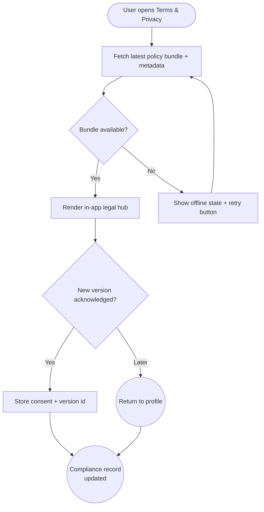

import FeatureSummary from '@site/src/components/FeatureSummary';

# T&C / Policy v0.2

## Summary

<FeatureSummary />

## Narrative
T&C / Policy v0.2 introduces the in-app legal hub. Instead of linking out to PDFs or external webpages, AWATERRA presents Terms, Privacy, and data use explanations in a native sheet managed through the Admin Area CMS. Each document tracks effective dates, locale translations, and a concise summary so users understand what changed. When policies update, the system prompts users to acknowledge the new version and stores consent timestamps tied to their profile.

The experience centers on transparency. The top banner shows the current version, effective date, and a link to the change log. Sections break the document into expandable accordions (data usage, subscriptions, feedback handling). For offline scenarios, the client caches the last acknowledged version and surfaces a “Will sync on reconnection” banner. Support agents can reference the same content through the info page, ensuring consistent wording across channels.

## Interaction
1. User taps “Terms & Privacy” from Profile, onboarding footer, or notification prompt.
2. App requests the latest policy bundle (`terms`, `privacy`, `data_handling`) from the CMS-backed API, including effective dates and change summaries.
3. Sheet renders with quick links (Overview, Data, Payments, Feedback) and expandable sections; toggles within highlight new or updated clauses.
4. When a new version exists, the user sees an acknowledgement banner; tapping “Agree & Continue” records consent and unlocks the rest of the app.
5. User can export or share a copy via native share sheet; the app logs the action for compliance reporting.
6. If the user declines, they return to profile with clear messaging and a path to contact support.

:::caution Edge Case
If the policy request fails and the device has no cached version, the app blocks acknowledgement and shows a retry state; we never assume consent without presenting the text.
:::

:::tip Signals of Success
- ≥95 % of users view the inline summary before accepting updates.
- Consent records include version id, timestamp, and locale for every acknowledgement.
- Support tickets about “Where do I find the terms?” drop significantly.
:::

### Journey

## Requirements
- **Acceptance criteria**
  - GIVEN a user opens the legal hub WHEN content loads THEN Terms, Privacy, and Data sections display with effective date, version, and change summary.
  - GIVEN the CMS publishes a new policy WHEN the user next opens the app THEN the acknowledgement banner blocks sensitive flows until consent is captured or the user logs out.
  - GIVEN offline access WHEN a cached version exists THEN the app shows cached text with an offline badge and requests fresh data once the network returns.
- **No-gos & risks**
  - Deep-linking to out-of-date web pages that contradict the in-app version.
  - Allowing practice starts before required legal acknowledgement after a policy change.
  - Missing locale coverage for Russian/English, which would block onboarding for some users.

## Data
- Primary metric: Policy acknowledgement rate per release within seven days of publication.
- Secondary checks: Time-to-acknowledge distribution, share/export events, and the volume of support contacts about legal content.
- Telemetry requirements: Log policy bundle version served, acknowledgement outcomes, declinations, offline fallback usage, and share/export actions.

## Open Questions
- Do we need optional email receipts summarizing policy changes for users who opt in?
- How granular should the change log be (section-level diff vs high-level summary)?
- Should we auto-open the legal hub after major updates or rely on notifications plus gated flows?
