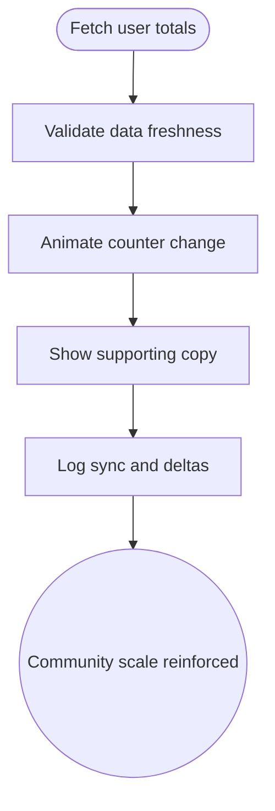

import FeatureSummary from '@site/src/components/FeatureSummary';

# Total User Counter

## One-Glance Summary

<FeatureSummary />

## Narrative
Total User Counter is the simplest expression of our living community. By aggregating live participation and presenting it in an elegant animation, the feature helps users feel part of something larger. The counter appears on the home Light Map and Pulse surfaces, synchronizing with underlying metrics.

The experience needs to balance accuracy, motion, and calmness. Updates should feel alive without distracting from the broader interface, and messaging must clarify what the number represents so trust grows with every glance.

## Interaction Blueprint
1. Aggregate total connected and active user counts across relevant services.
2. Stream the value to clients with sensible caching to prevent flicker.
3. Animate the counter for increases and decreases with mindful easing.
4. Surface contextual copy that describes the moment (e.g., "Practicing now").
5. Provide hover or tap affordances for deeper stats when available.
6. Log synchronization and delta timing to monitor accuracy.

- Edge case: Sudden drops due to data lag; hold the previous value and show a syncing state rather than oscillating wildly.

- Signals of success:
  - Counter updates within expected latency and mirrors backend telemetry.
  - Users reference the number in qualitative feedback as a reason to stay engaged.
  - Animations remain smooth across devices and respect reduced-motion preferences.

### Mermaid Journey IN MERMAID FORMAT

## Requirements & Guardrails
- **Acceptance criteria**
  - GIVEN new telemetry WHEN the counter updates THEN the value animates within 1 second without jitter.
  - GIVEN data delays WHEN freshness drops below SLA THEN display a syncing state instead of misleading numbers.
  - GIVEN accessibility preferences WHEN reduced motion is enabled THEN transitions swap to crossfades or step changes.
- **No-gos & risks**
  - Misreporting totals undermines confidence in the broader analytics story.
  - Overly flashy animations conflict with the calm tone of the experience.
  - Pulling raw identifiable data rather than aggregated counts could violate privacy commitments.

## Data & Measurement
- Primary metric: Accuracy rate comparing displayed totals vs. backend truth at sample intervals.
- Secondary checks: Update latency, user interactions with the counter, and qualitative sentiment.
- Telemetry requirements: Log timestamp of each update, delta magnitude, and fallback states triggered.

## Open Questions
- Should we segment the counter (global vs. local) for v0.1 or keep to a single global number?
- How often should we poll or stream to balance freshness with network efficiency?
