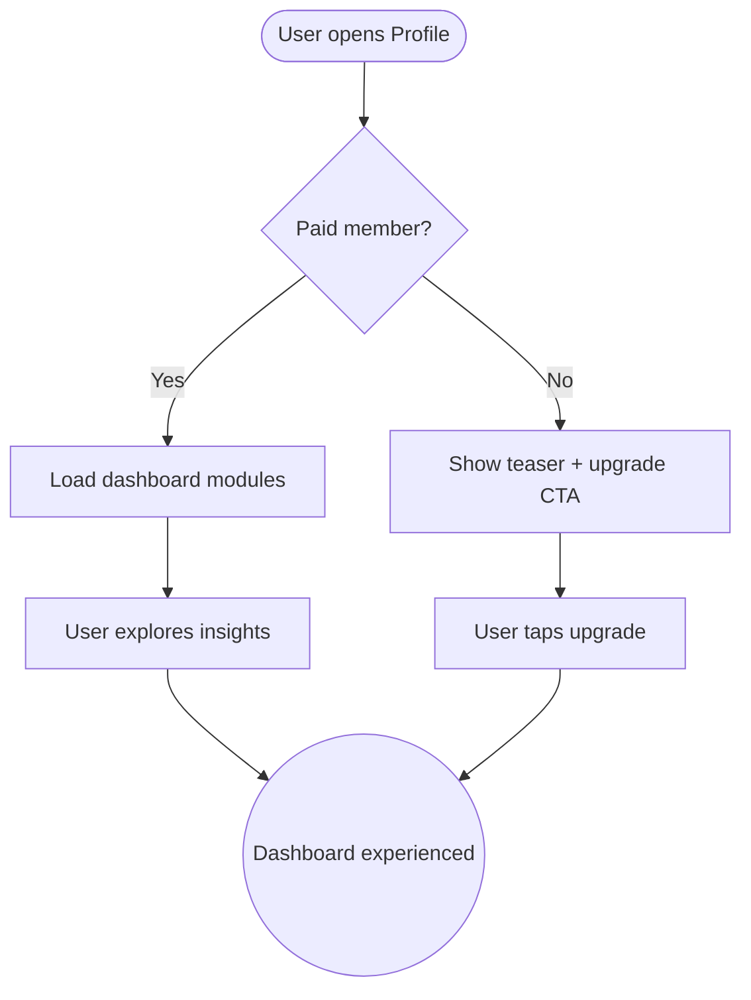

import FeatureSummary from '@site/src/components/FeatureSummary';

# User Profile and Dashboard v1

## Summary

<FeatureSummary />

## Narrative
Ignition graduates the profile from a static bio into a living dashboard. Paid members can review their practice streaks, reaction mix, most-saved practices, AWAWAY milestones, missions funded, and motivational stats that previously lived across the product. When free users accumulate enough data, we tease the dashboard and prompt them to upgrade.

The layout blends avatar (“AWASO” internal view), geometry, charts, and insights while keeping AWATERRA’s calm aesthetic. Each module references shared data services so numbers match everywhere.

## Interaction
1. Profile detects whether the user is paid; if not, show teaser cards and upgrade CTA once data thresholds are met.
2. Dashboard modules load asynchronously: practice totals, reaction wheel, saved practices, AWAWAY progress, missions supported, motivational streak copy.
3. Each module offers contextual actions (open Saved list, view AWAWAY spiral, download dashboard).
4. Premium badges highlight unique perks (offline archive, master following).
5. When the user taps upgrade, deep-link to the Subscription Page with context (“Unlock full dashboard analytics”).
6. Paid members can reorder modules and choose which to display.
7. Analytics track module views, interactions, and upgrade conversions.

:::caution Edge Case
If a module’s data source fails (e.g., acquisition analytics down), show a placeholder card with “Syncing data” instead of breaking the layout.
:::

:::tip Signals of Success
- Paid members regularly engage with the dashboard modules.
- Free users convert after seeing teasers when they hit the data threshold.
- Metrics remain consistent with other product surfaces (no conflicting numbers).
:::

## Journey

## Requirements
- **Acceptance criteria**
  - GIVEN a paid user opens profile WHEN data loads THEN all modules display accurate, up-to-date metrics with graceful loading states.
  - GIVEN a free user crosses the defined usage threshold WHEN they open profile THEN teaser modules explain what’s available and provide an upgrade path.
  - GIVEN a module encounters an error WHEN rendering THEN it shows a placeholder with retry action rather than breaking the page.
- **No-gos & risks**
  - Duplicating data queries per module can spike latency; use shared data fetches.
  - Overwhelming users with dense charts contradicts the calm brand; keep visuals airy.
  - Failing to clearly separate free vs paid content may trigger complaints or platform review issues.

## Data
- **Primary metric:** Dashboard engagement rate (sessions with module interactions ÷ paid sessions).
- **Secondary checks:** Upgrade conversion from teasers, module error rate, customization usage, and placeholder frequency.
- **Telemetry requirements:** Log module load times, errors, interactions, upgrade CTA taps, threshold triggers, and customization events.

## Open Questions
- How customizable is the layout at launch (reorder vs hide)?
- Do we allow sharing individual modules (e.g., reaction wheel) in addition to the full dashboard export?
