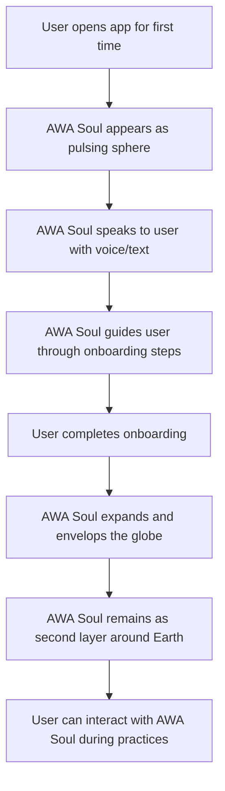

version: "0.1"
capability: "visualization-map-layer"
capability: "visualization-map-layer"
rank: 1

# AWA Soul

## Overview
AWA Soul is a unique character-space that serves as the symbol of the AWATERRA community. It appears as a sphere of approximately 50,000 pulsing light points that guides users through onboarding and practice sessions, creating an instant sense of global community and spiritual connection.

## Purpose
The business need this feature addresses is creating an emotional connection and sense of belonging for users, providing a spiritual guide that represents the collective energy of the AWATERRA community and helps users feel part of something larger than themselves.

## User Stories

### Primary User Story
As a new user, I want to be greeted by AWA Soul during onboarding so that I feel welcomed into the AWATERRA community and understand the spiritual nature of the platform.

### Secondary User Stories
- As a user, I want AWA Soul to guide me through my first practice
- As a user, I want to see AWA Soul respond to my interactions
- As a user, I want to feel the collective energy of the community through AWA Soul
- As a user, I want AWA Soul to be present during my practice sessions

## User Flow

## Visual Design
- Sphere of ~50,000 light points using Fibonacci Sphere algorithm
- Points of different sizes and brightness creating "breathing" effect
- Pulsation and breathing animations
- Points can intensify and form shapes during dialogue
- Smooth transitions between states
- Ambient cosmic sound design

## Acceptance Criteria
- AWA Soul is visible and "talking" during onboarding
- Practice is guided by AWA Soul visually
- AWA Soul responds to user interactions
- Smooth transitions between AWA Soul states
- Voice synthesis works correctly
- AWA Soul envelops globe after onboarding
- User feels connected to the spiritual community

## Examples

### AWA Soul Characteristics
- **Visual**: Sphere of 50,000 pulsing light points
- **Algorithm**: Fibonacci Sphere distribution
- **Breathing Effect**: Points of different sizes and brightness
- **Dialogue Response**: Points intensify and form shapes
- **Metaphor**: Each light = AWATERRA community member
- **Role**: Spiritual guide and community symbol

### Light Map WOW Moment
- **Trigger**: Automatic transition to Home/Light Map after onboarding
- **Visual Effects**: 3D globe with thousands of pulsing light points
- **Real-time**: Light bursts appear in real-time
- **AWA Pulse**: Heartbeat graph (e.g., "72 bpm")
- **Sound**: Planetary heartbeat and ambient cosmic tones
- **User Counter**: "With us now 23,456 participants"
- **Interactive**: Geolocation request, globe rotation/zoom, "Ignite Your Light" CTA

## Related Documentation

- [02. Visualization & Map Layer](/docs/capabilities/02-Visualization-Map-Layer)
- [03. Access](/docs/capabilities/03-Access) - Onboarding flow
- [05. Practice](/docs/capabilities/05-Practice) - Practice guidance
- [Version 0.1 Photon](/docs/versions/0.1-photon/intro)

---
version: "0.1"
capability: "visualization-map-layer"
capability: "visualization-map-layer"
rank: 1

*Feature last updated: December 2024*