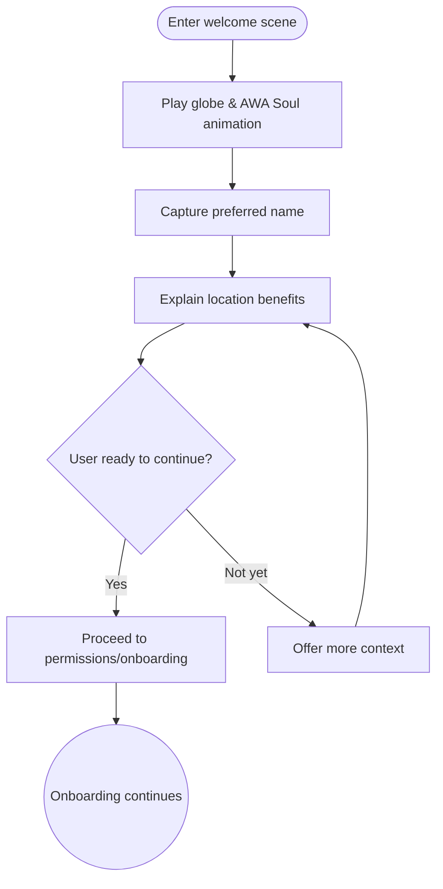

import FeatureSummary from '@site/src/components/FeatureSummary';

# Welcome Animation

## Summary

<FeatureSummary />

## Narrative
The Welcome Animation bridges the Loading Screen and onboarding. It invites users to share their name, watch the globe awaken, and feel AWA Soul guiding the experience. Motion stays purposeful so light flows outward and hints at the global network ahead.

The sequence also sets context for location access, primes community participation, and transitions into guided setup without breaking immersion.

## Interaction
1. Launch the welcome scene after the loading sequence on first run or post-update resets.
2. Animate the globe and AWA Soul elements while displaying the hero copy about shared light.
3. Collect the user’s preferred name and confirm consent before proceeding.
4. Introduce geolocation benefits and prepare for the permission request.
5. Offer controls to continue, skip, or learn more, maintaining a gentle pace.
6. Persist onboarding progress so returning users skip or resume appropriately.

:::caution Edge Case
Users skip quickly. Surface essential context such as name capture and location rationale later if they bypass the scene.
:::

:::tip Signals of Success
- Completion rate of the welcome flow stays high with minimal friction.
- Users provide their name and consent signals without confusion.
- Transitions to subsequent onboarding steps stay smooth and thematically aligned.
:::

### Journey

## Requirements
- **Acceptance criteria**
  - GIVEN a new user WHEN the welcome animation plays THEN prompts for name and context are clear and skippable without losing essential information.
  - GIVEN accessibility preferences WHEN reduced motion is enabled THEN animation simplifies but still conveys warmth.
  - GIVEN a returning user WHEN the app launches THEN the animation only replays after significant updates or when the user opts in.
- **No-gos & risks**
  - Overly long sequences that delay onboarding.
  - Mandatory name collection without explanation diminishes trust.
  - Location requests without clear value proposition risk denial.

## Data
- Primary metric: Completion rate of the welcome flow including successful name capture.
- Secondary checks: Permission acceptance rates following the sequence, skip frequency, and user sentiment.
- Telemetry requirements: Log animation start/end, input submissions, skips, and permission prompt follow-through.

## Open Questions
- Should the animation adapt copy or visuals based on locale or time of day in v0.1?
- How soon should we replay the welcome experience for returning users (e.g., major releases, seasonal moments)?
