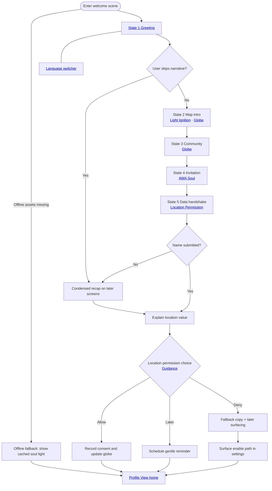

import FeatureSummary from '@site/src/components/FeatureSummary';

# Welcome Animation

## Summary

<FeatureSummary />

## Narrative
The Welcome Animation is a single continuous canvas. [AWA Soul](./awa-soul.md) "types" the onboarding narrative in short beats while [Light Ignition](./light-ignition.md) warms the frame and the [Globe](./globe.md) reacts in place. No new screens appear—the entire onboarding arc unfolds as consecutive states on one surface.

As the message resolves, the globe evolves through Light Ignition → AWA Soul expansion → community Globe before the location prompt glides up on the same layer. Copy, light, and geography stay synchronized so the guide speaks, the soul brightens, and the user remains anchored, with each state pointing back to its dedicated visualization feature doc for implementation details. Text reveals with a luminous typewriter effect inspired by modern AI assistants so the user feels guided by a living interface. The final dissolve takes the user directly into [Profile View](./profile-view.md), our home surface for all future sessions.

:::note Terminology
Throughout this document “state” refers to each beat on the single welcome screen. What used to be multiple screens in Russian copy are now sequential states of the same canvas.
:::

### State narrative on the single canvas
1. **State 1 – Greeting & Safety**
   - Copy reassures the user that we have been waiting, they are safe, and AWATERRA protects authenticity (see Copy Reference for bilingual text).
   - Visual rhythm: Light Ignition breathes softly around a dormant Globe while the Soul avatar types the message line by line.
   - UI anchors the language switcher from [Language Settings](./language-settings.md) in the corner so users can toggle locales without leaving the flow.
2. **State 2 – Space / Map Introduction**
   - Copy explains AWATERRA as the first spiritual social network and introduces the living map of practice sparks.
   - Visual rhythm: Light Ignition flares into the user's local soul spark; the Globe shifts from dark to illuminated arcs that trace practice locations.
3. **State 3 – Community Presence**
   - Copy invites the user to notice thousands of nearby lights and a global community choosing the path to Soul.
   - Visual rhythm: The Globe reveals clusters of souls pulsing worldwide while the Soul avatar gestures to the horizon.
4. **State 4 – Invitation**
   - Copy calls the user to ignite their own light and welcomes them home.
   - Visual rhythm: The user's soul spark expands, linking Light Ignition and Globe constellations into one halo.
5. **State 5 – Data Handshake**
   - Copy asks for the user's name and consent to show their light on the map before requesting location access.
   - Visual rhythm: Name entry lives inline beneath the typed message; the Globe hovers close, ready to place the new ember once permission is granted.
   - A translucent drawer references [Location Permission During Onboarding](./location-permission-onboarding.md) copy, explaining why geo access matters before the system prompt appears.
   - Once complete, the welcome canvas eases into [Profile View](./profile-view.md) where the user's light, menu, and next actions live.

## Light Ignition • Soul • Globe choreography
- **Light Ignition** ([feature doc](./light-ignition.md)) kicks off every state change. Warm pulses breathe in sync with the typed lines, framing the Soul avatar and setting the emotional tempo.
- **AWA Soul** ([feature doc](./awa-soul.md)) remains the narrator. The typewriter cadence matches the pulse timing, and micro-gestures signal each transition (soft hand raise for the map reveal, open posture for the community pledge).
- **Globe** ([feature doc](./globe.md)) starts dormant, then transitions: ember glow (State 1) → spark trails (State 2) → populated constellations (State 3) → user halo link (State 4) → geo prompt focus ring (State 5).
- **State continuity** keeps the user in place. No navigation occurs; the same viewport hosts copy, form field, and the permission call-to-action so the narrative never resets.
- **Language switcher** from [Language Settings](./language-settings.md) remains accessible across states without interrupting the animation cadence.
- **Location drawer** uses the [Location Permission During Onboarding](./location-permission-onboarding.md) pattern to stage education before invoking the native permission request.

## Interaction
1. Dissolve directly from the loading screen into State 1 on first run or after major updates, preserving the same camera and color temperature.
2. Let the shimmering typewriter cadence trigger each state change: Light Ignition cue → Soul line animation → Globe response → copy lock-in.
3. Keep all focus on the central canvas; guidance icons or captions appear only when the Soul avatar gestures to them.
4. Surface the inline name field under the State 5 copy, confirm entry, and then continue the narration without jarring transitions.
5. Introduce the location rationale and permission card inside the same conversational thread, expanding the Globe halo around the user's region as the ask appears.
6. Provide gentle pacing controls (`Продолжить`, `Пропустить`, `Подробнее`) that advance the typed script instead of navigating away, and persist onboarding progress for returning users.
7. If the user declines geo access, surface a settings entry point consistent with [Location Permission During Onboarding](./location-permission-onboarding.md) so they can enable it later without friction.
8. Transition seamlessly into [Profile View](./profile-view.md) once the final line lands, carrying over name, consent state, and Globe focus.

:::caution Edge Case
Users skip quickly. Surface essential context such as name capture and location rationale later if they bypass the scene.
:::

:::tip Signals of Success
- Completion rate of the welcome flow stays high with minimal friction.
- Users provide their name and consent signals without confusion.
- Transitions to subsequent onboarding steps stay smooth and thematically aligned.
:::

### Journey

## Requirements
- **Acceptance criteria**
  - GIVEN a new user WHEN the welcome animation plays THEN the typewriter script, name capture, and permission context run in sequence on a single screen without disruptive navigation.
  - GIVEN the animation WHEN copy reveals on screen THEN it uses a shimmering AI-inspired type-to-reveal treatment while remaining readable and accessible.
  - GIVEN accessibility preferences WHEN reduced motion or reduced transparency is enabled THEN the script plays without intense effects while keeping the typed cadence readable.
  - GIVEN a user declines location WHEN the drawer closes THEN the app stores state and surfaces a settings pathway aligned with [Location Permission During Onboarding](./location-permission-onboarding.md).
  - GIVEN the sequence completes WHEN the final line lands THEN the user transitions directly into [Profile View](./profile-view.md) without intermediate screens.
  - GIVEN a returning user WHEN the app launches THEN the animation only replays after significant updates or when the user opts in, maintaining state continuity.
- **No-gos & risks**
  - Overly long sequences that delay onboarding.
  - Mandatory name collection without explanation diminishes trust.
  - Location requests without clear value proposition risk denial.

## Data
- Primary metric: Completion rate of the welcome flow including successful name capture.
- Secondary checks: Permission acceptance rates following the sequence, skip frequency, and user sentiment.
- Telemetry requirements: Log animation start/end, input submissions, skips, and permission prompt follow-through.

## Related Feature Docs
- [Light Ignition](./light-ignition.md) - visual language for the breathing shell that cues each welcome state.
- [AWA Soul](./awa-soul.md) - narrative guide, copy cadence, and personalization beats.
- [Globe](./globe.md) - live map visuals that evolve across the welcome animation states.
- [Language Settings](./language-settings.md) - localized experience controls surfaced as the welcome screen language switcher.
- [Location Permission During Onboarding](./location-permission-onboarding.md) - rationale, flows, and deferred pathways for geo access.
- [Profile View](./profile-view.md) - the home surface users reach after the welcome journey, anchoring globe, menu, and practice actions.

## Copy Reference

| State | English copy | Russian copy |
| --- | --- | --- |
| 1 – Greeting & Safety | Breathe out. We've been waiting for you. You're safe. No ads, no algorithms, no selling data. Here you can be your true self. Only your soul matters here. | Выдохни. Мы тебя ждали. Ты в безопасности. Без рекламы, без алгоритмов, без продажи данных. Здесь можно быть настоящим. Здесь важна только твоя душа. |
| 2 – Space / Map Introduction | AWATERRA is the first spiritual social network. We make inner light visible. Every minute of your practice lights a spark on the living map of the world. That's how we find one another. This is the first map of conscious people on Earth. | AWATERRA — первая духовная социальная сеть. Мы делаем внутренний свет видимым. Каждая минута твоей практики зажигает искру на живой карте мира. Так мы находим друг друга. Это первая карта осознанных людей Земли. |
| 3 – Community Presence | Look: thousands of lights shine beside you. Across the Earth, millions of people right now choose the path to their Soul. This is the AWATERRA community. Together we make the world brighter. | Посмотри: тысячи огней сияют рядом с тобой. По всей Земле миллионы людей прямо сейчас выбирают путь к своей Душе. Это сообщество AWATERRA. Вместе мы делаем мир светлее. |
| 4 – Invitation | Ignite your light. We will stay close. Welcome to AWATERRA. Welcome home. | Зажги свой свет. Мы будем рядом. Добро пожаловать в AWATERRA. Добро пожаловать домой. |
| 5 – Data Handshake | Shall we get acquainted? What's your name? May we show your light on the map? We need your location for that. [Allow] [Later]. | Познакомимся? Как тебя зовут? Покажем твой свет на карте? Для этого нужна геолокация. [Разрешить] [Позже]. |

## Open Questions
- Should the animation adapt copy or visuals based on locale or time of day in v0.1?
- How soon should we replay the welcome experience for returning users (e.g., major releases, seasonal moments)?
