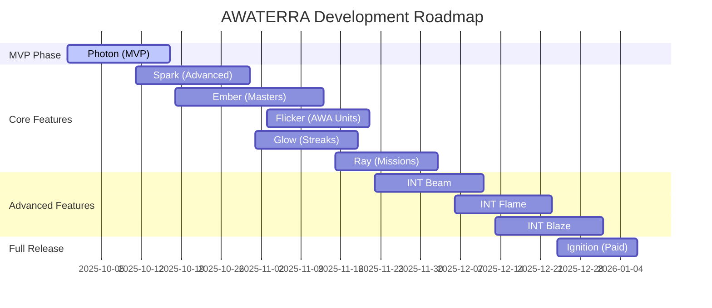

# Development Roadmap

This section outlines the development phases and version releases for the AWATERRA platform.

## Version Overview

The AWATERRA platform is being developed in phases, from MVP to full release, with each version building upon the previous one.

## Release Timeline

## Version Details

### 0.1 Photon 🔹 (MVP)
**Release**: September 29 - October 17, 2025

Core functionality and infrastructure:
- Push Notifications
- Backend Infrastructure Setup
- Location Permission during Onboarding
- Practice Screen
- Profile View
- Light Ignition
- AWA Pulse (Basic)
- Globe Visualization
- AWA Soul
- Prototype 3D Map with FPS stats
- GDPR Compliance
- Loading Screen
- App Architecture and Base
- Localization Management
- Basic Analytics
- Welcome Animation
- Language Settings
- Profile Management
- Notification Settings
- Application Settings
- Practices List
- Feedback System
- App Store Release
- FAQ System
- Admin Area v0.1

### 0.2 Spark ✨ (Advanced Practices)
**Release**: October 11 - October 31, 2025

Enhanced practice features:
- History of Completed Practices with Reactions
- Practice Reaction System
- Enhanced Feedback System
- Google Store Release
- Terms & Conditions
- Info Page

### 0.3 Ember 🧡 (Basic Masters and Collective)
**Release**: October 18 - November 13, 2025

Master-led practices:
- Practice Screen (Masters)
- Master Card (Bio)
- New Features Notification Screen
- Add Master Practice to Calendar
- AWA Pulse (Master/Collective)

### 0.4 Flicker 💛 (Basic AWA Units + Registration)
**Release**: November 3 - November 21, 2025

Monetization and user management:
- Sign up Apple + Google
- Sign Up Email
- AWA Pulse (AWA Unit)

### 0.5 Glow 🟡 (Basic Streaks - AWAWAY)
**Release**: November 1 - November 19, 2025

Gamification system:
- Daily Streak Reminder

### 0.6 Ray ☀️ (Basic Missions)
**Release**: November 15 - December 3, 2025

Mission system implementation.

### 0.7-0.9 Advanced Features
**Releases**: November 22, 2025 - January 1, 2026

Progressive enhancement of advanced features.

### 1.0 Ignition 🚀 (Paid Platform)
**Release**: December 24, 2025 - January 7, 2026

Full paid platform with all premium features.

## Development Phases

### Phase 1: Foundation (Photon)
Establish core infrastructure and basic user experience.

### Phase 2: Enhancement (Spark - Ray)
Add advanced features and improve user engagement.

### Phase 3: Monetization (Flicker - Glow)
Introduce premium features and user retention systems.

### Phase 4: Scale (INT Beam - Ignition)
Full platform launch with comprehensive feature set.

## Key Milestones

- **MVP Launch**: October 17, 2025
- **Premium Features**: November 21, 2025
- **Full Platform**: January 7, 2026

---

*Roadmap last updated: December 2024*
