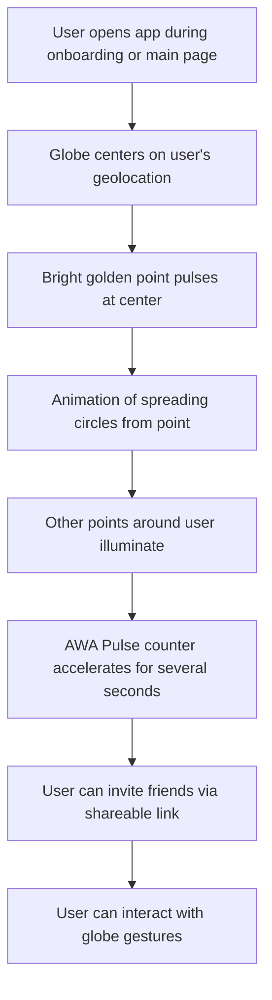

# Globe

## Overview
The Globe feature provides users with an interactive 3D visualization of the AWATERRA community, allowing them to locate and track their activity and see others in their vicinity. It displays real-time user activity through particles and visual effects, creating a sense of global connection and community.

## Purpose
The business need this feature addresses is creating a sense of global community and belonging, allowing users to see their place in the larger AWATERRA ecosystem and feel connected to other practitioners worldwide.

## User Stories

### Primary User Story
As a user, I want to see my location and activity on a global map so that I can feel connected to the worldwide AWATERRA community.

### Secondary User Stories
- As a user, I want to see other users' activity in my area
- As a user, I want to invite friends to join the community
- As a user, I want to see real-time updates of global activity
- As a user, I want to interact with the globe through gestures

## User Flow

## Visual Design
- Interactive 3D globe centered on user's location
- Bright golden pulsing point at user's location
- Spreading circle animations from user's point
- Other surrounding points illuminated
- AWA Pulse counter acceleration effect
- Invite friend functionality with shareable links

## Acceptance Criteria
- User's location is visible and accurate
- User's activity is displayed in real-time
- Last practice time is updated correctly
- Other users' activity is visible in vicinity
- Invitation links work correctly
- AWA Pulse counter accelerates appropriately
- Globe interactions work smoothly
- User feels connected to global community

## Examples

### Visual Effects
- **Globe Centering**: Automatically centers on user's location
- **Golden Point**: Bright pulsing point at user's location
- **Spreading Circles**: Animation of circles expanding from user's point
- **Surrounding Points**: Other users' activity illuminated
- **Pulse Acceleration**: AWA Pulse counter speeds up temporarily
- **Invite Friend**: Copy link to invite others to join AWATERRA

### User Experience
- **Real-time Updates**: Live activity from users worldwide
- **Interactive Controls**: Rotate, zoom, and explore the globe
- **Community Connection**: See how many people are practicing
- **Location Awareness**: Understand your place in the global community

## Related Documentation

- [02. Visualization & Map Layer](/docs/capabilities/02-Visualization-Map-Layer)
- [03. Access](/docs/capabilities/03-Access) - Location permissions
- [06. Engagement & Notifications](/docs/capabilities/06-Engagement-Notifications)
- [Version 0.1 Photon](/docs/versions/0.1-photon/intro)

---

*Feature last updated: December 2024*