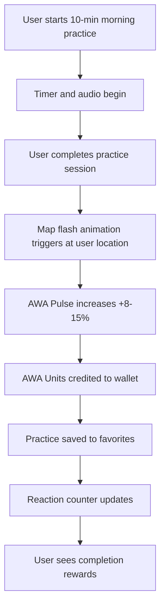

# Light Ignition

## Overview
Light Ignition is a core visualization feature that provides users with immediate visual feedback and rewards after completing a practice session. It creates a "WOW moment" by displaying a visual flash on the world map, contributing to the global AWA Pulse, crediting AWA Units, and allowing users to save favorite practices.

## Purpose
The business need this feature addresses is creating an engaging, rewarding experience that motivates users to continue practicing and feel connected to the global AWATERRA community through visual feedback and gamification elements.

## User Stories

### Primary User Story
As a user, I want to see immediate visual feedback after completing a practice so that I feel rewarded and connected to the global community.

### Secondary User Stories
- As a user, I want to see my practice contribution on the world map
- As a user, I want to earn AWA Units for completing practices
- As a user, I want to save my favorite practices for quick access
- As a user, I want to see how my practice contributes to the global pulse

## User Flow

## Visual Design
- Visual flash animation on the world map showing practice trail
- Pulsing golden point at user's location
- Spreading circle animations from the practice point
- AWA Pulse counter acceleration effect
- Heart reaction counter (❤️) for each practice
- Smooth animations and transitions

## Acceptance Criteria
- Session is saved after practice completion
- Map is updated with visual flash at user location
- AWA Pulse increases by 8-15%
- AWA Units credited to registered users
- Practice saved to favorites (respecting limits: 3 for Free, unlimited for Journey)
- Reaction counter updates correctly
- Visual effects render smoothly
- User feels rewarded and connected to community

## Examples

### User Rewards
- **Visual Flash**: Trail of practice on world map
- **AWA Pulse Contribution**: Global planet pulse increase
- **AWA Units**: Credited to wallet (registered users only)
- **Reaction Counter**: ❤️ counter for each practice
- **Favorites**: Save practices (3 for Free, unlimited for Journey)

### Practice Content
- **Morning Practice**: "Утро. Сотвори сценарий дня" (10 minutes)
- **Visual Effects**: Bright golden pulsing point, spreading circles
- **Community Impact**: Contribution to global AWA Pulse
- **Personal Rewards**: AWA Units and practice saving

## Related Documentation

- [02. Visualization & Map Layer](/docs/capabilities/02-Visualization-Map-Layer)
- [05. Practice](/docs/capabilities/05-Practice)
- [09. Gamification & Rewards](/docs/capabilities/09-Gamification-Rewards)
- [Version 0.1 Photon](/docs/versions/0.1-photon/intro)

---

*Feature last updated: December 2024*